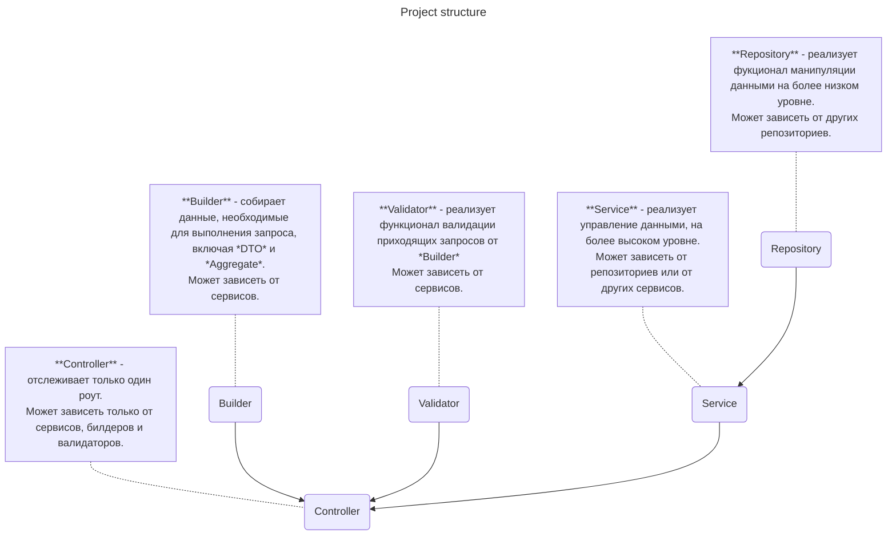

# Hikilist

## Migrations

### Create migration

```sh
task create-migration <migration_name>
```

### Migrate

```sh
task up
```

## Project structure


```mermaid
---
title: Project structure
---

flowchart TD
    Repository(Repository)
    Service(Service)
    Builder(Builder)
    Validator(Validator)
    Controller(Controller)

    RepositoryNote["
    **Repository** - реализует фукционал манипуляции данными на более низком уровне.
Может зависеть от других репозиториев.
"] -.- Repository

ServiceNote["
**Service** - реализует управление данными, на более высоком уровне.
Может зависеть от репозиториев или от других сервисов.
"] -.- Service

BuilderNote["
**Builder** - собирает данные, необходимые для выполнения запроса, включая *DTO* и *Aggregate*.
Может зависеть от сервисов.
"] -.- Builder

ValidatorNote["
**Validator** - реализует функционал валидации приходящих запросов от *Builder*
Может зависеть от сервисов.
"] -.- Validator

ControllerNote["
**Controller** - отслеживает только один роут.
Может зависеть только от сервисов, билдеров и валидаторов.
"] -.- Controller

Repository --> Service
Builder --> Controller
Validator --> Controller
Service --> Controller
```
