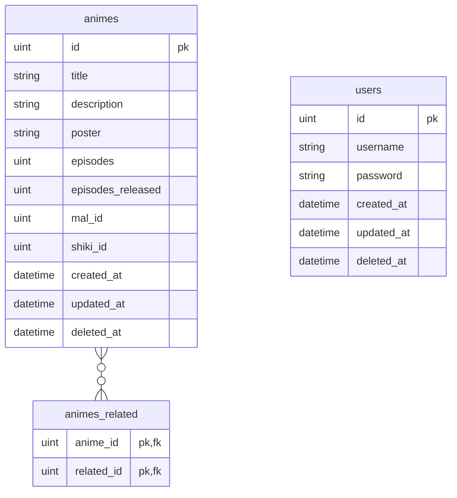

# Golang API template

## Setup

```sh
go run setup.go
```

## Migrations

### Make migrations

```sh
atlas migrate diff --env gorm
```

### Migrate

```sh
atlas schema apply --env gorm --url "<dsn>"
```

## Entities

### Schema


