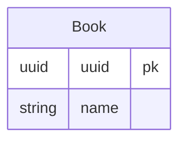

# Enities

## Entity relationship diagram

```mermaid
erDiagram
    Book {
        uuid uuid pk
        string name
    }
```

## Book

```mermaid
erDiagram
    Book {
        uuid uuid pk
        string name
    }
```
